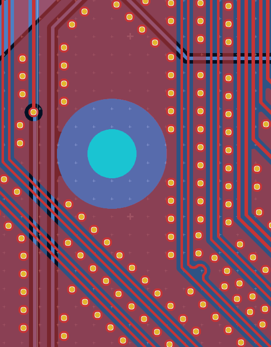
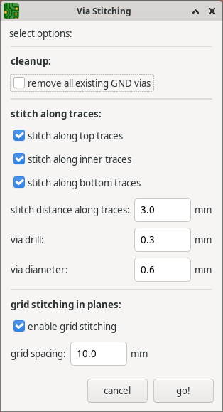

# via_stitching_plugin

a vibe-coded KiCAD ActionPlugin that adds GND vias along traces - so called "via stitching".

if not all alarm bells have been triggered yet: **this is experimental code**

**use at your own risk**

**thoroughly go through DRC after applying**

## collision detection "we" implemented along the way
- **courtyard avoidance** - respects component keepout zones (the pink F&B CrtYd)
- **copper clearance** - maintains proper spacing from all copper on all layers
- **pad clearance** - includes soldermask expansion zones and pad clearances
- **board edge clearance** - respects edge constraints from design rules
- **via-to-via spacing** - prevents overlapping vias
- **length tuning preservation** - avoids placing vias on meandered traces

## Installation
1. copy the `via_stitching_plugin` folder into one of KiCAD's plugin folders, or add its parent folder to KiCAD's plugin search paths. Typical user plugin paths on Linux:
   - ~/.local/share/kicad/9.0/3rdparty/plugins

2. restart KiCAD or at least the PCB editor. The plugin appears under Tools->External_Plugins and as a toolbar button.

## Icon

 
## License

same as KiCAD itself.

GNU General Public License (GPL) Version 3

see [LICENSE](LICENSE)